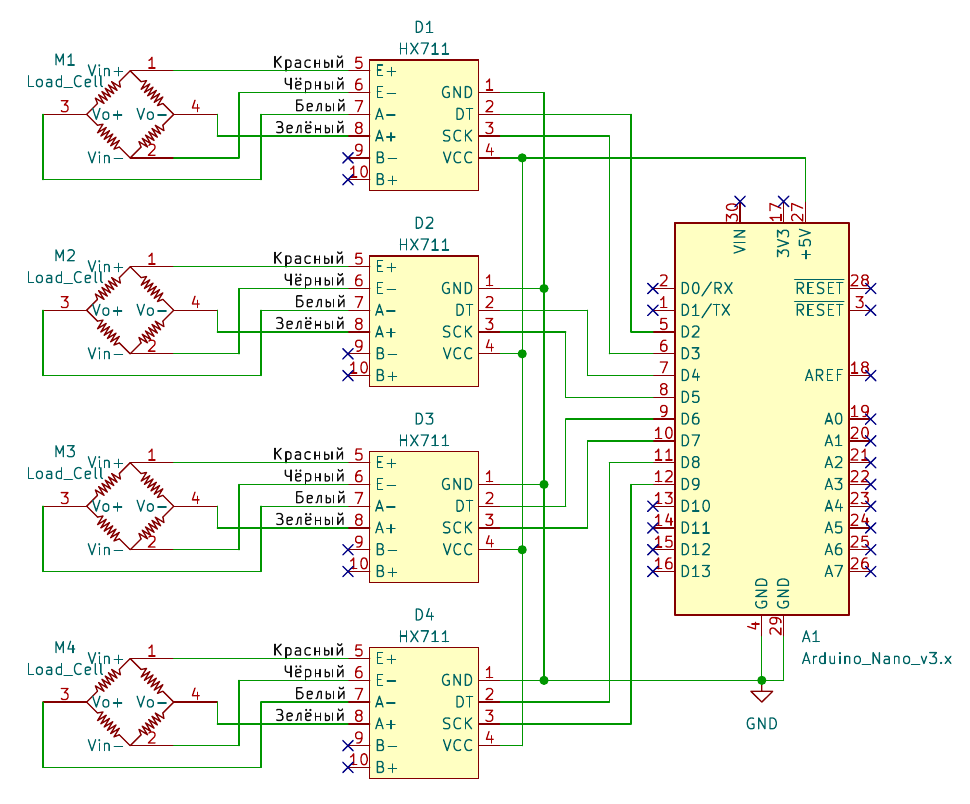

# Arduino Nano Scales

- [Description](#description)
- [Dependencies](#dependencies)
- [Wiring scheme](#wiring-scheme)
- [Usage examples](#usage-examples)

## Description

Arduino sketch for creating a four-channel scales based on HX711 ADC.

Main features:
- Get average weight
- Weight reading from each ADC (faster)
- Taring
- Calibration with saving values in EEPROM

## Prerequisites

- [HX711 Library](https://github.com/RobTillaart/HX711) >= 0.3.9
- [CRC Library](https://github.com/RobTillaart/CRC) >= 1.0.2

## Wiring scheme



## Usage examples

### Average weight request

Request:
```
AWEND
```

Response:
```
AW-115.45END
```

### Weight request

Request:
```
WEND
```

Response:
```
WF11.68S-4183.17T2856.54F-2606.26
```
where 11.68 from first load cell, -4183.17 from second load cell, 2856.54 from third load cell and -2606.26 from fourth cell

### Taring request

Request:
```
TAREEND
```

Response:
```
TAREEND
```

### Get calibration factor

A typical request looks like ```GETCAL$1END```, where ```$1``` is load cell number (from 1 to 4).

Request:
```
GETCAL1END
```

Response:
```
GETCAL-3END
```

Error:
```
GETCALERREND
```

### Set calibration factor

A typical request looks like ```GETCAL$1$2END```, where ```$1``` is load cell number (from 1 to 4), ```$2``` is calibration factor.

Request:
```
SETCAL1-115END
```

Response:
```
SETCAL1END
```

Error:
```
SETCALERREND
```

## License


The library is licensed under [GNU Lesser General Public License 3.0](https://www.gnu.org/licenses/lgpl-3.0.txt):

Copyright © 2024 Dmitry Plastinin

Arduino Nano Scales is free software: you can redistribute it and/or modify it under the terms of the GNU Lesser General Public License as pubblished by the Free Software Foundation, either version 3 of the License, or (at your option) any later version.

UToolbox Timers is distributed in the hope that it will be useful, but WITHOUT ANY WARRANTY; without even the implied warranty of MERCHANTABILITY or FITNESS FOR A PARTICULAR PURPOSE. See the GNU Lesser Public License for more details
